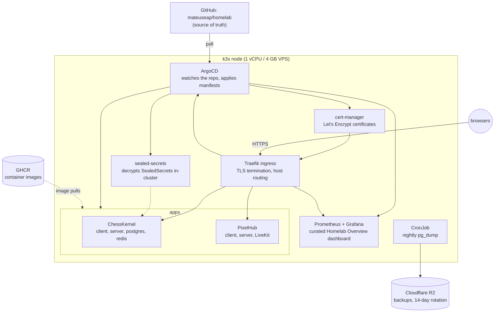
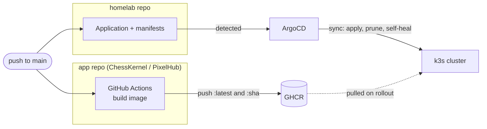
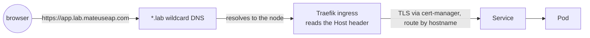

<div align="center">

# 🏗 HomeLab

**One VPS, declared in git. Everything else is a `git push`.**  
GitOps · k3s · ArgoCD · Reproducible in ~30 minutes

[](LICENSE)
[](https://github.com/mateuseap/homelab/stargazers)
[](https://github.com/mateuseap/homelab)

<br />

</div>

---

## Why HomeLab?

Hand-configured servers rot: undocumented tweaks pile up, migrations become archaeology, and every new project means another SSH session. This repo is the single source of truth for my VPS. ArgoCD watches it and makes the cluster match, so the machine is disposable and the repo is forever.

- **Declarative.** Every workload, cert, secret, and backup job lives here as YAML.
- **Reproducible.** Fresh VPS to full platform in one script plus one DNS record.
- **Self-healing.** Drift gets reverted automatically; deleted resources come back.
- **Public-safe.** Secrets are sealed with the cluster key, so the repo can stay open.

## What runs on it

|  |  |
|--|--|
| ♟️ **[ChessKernel](https://github.com/mateuseap/chesskernel)** | Chess platform at [chesskernel.com](https://chesskernel.com) |
| 👾 **[PixelHub](https://github.com/mateuseap/pixelhub)** | Gather-style 2D world with proximity chat and voice |
| 🛰 **ArgoCD** | GitOps engine and live app dashboard (`argo.lab.mateuseap.com`) |
| 📈 **Grafana + Prometheus** | Metrics, trimmed for a 1 vCPU node (`grafana.lab.mateuseap.com`) |
| 🔐 **cert-manager** | Automatic Let's Encrypt TLS for every host |
| 🗝 **sealed-secrets** | Encrypted secrets, safe in public git |
| 💾 **Nightly backups** | `pg_dump` to Cloudflare R2, 14-day rotation |

## Architecture at a glance

**The cluster.** One k3s node runs the whole platform. Everything above the base layer is an ArgoCD Application defined in this repo.



**The deploy loop.** Merging to `main` is the only deploy action. App code and platform config both flow through git.



**The request path.** A browser reaches an app through one wildcard DNS record, TLS terminating at Traefik.



## Quick Start

```bash
git clone https://github.com/mateuseap/homelab && cd homelab
sudo bash bootstrap/install.sh
```

Point `*.lab.yourdomain.com` at the machine, seal your secrets, restore the latest backup. Full steps in the [runbook](docs/RUNBOOK.md).

> Adding a project: one folder in `apps/`, one Application manifest in `argocd/`, push. No SSH, no DNS changes.

## Stack

| Layer | Technology |
|-------|-----------|
| Kubernetes | k3s (single node, Traefik, local-path storage) |
| GitOps | ArgoCD v3.4.5 (app-of-apps, sync waves, auto prune + self-heal) |
| TLS | cert-manager v1.15.3 + Let's Encrypt HTTP-01 |
| Secrets | sealed-secrets |
| Monitoring | kube-prometheus-stack 62.7.0 (5-day retention, alertmanager off) |
| Backups | CronJob `pg_dump` to Cloudflare R2 (S3-compatible) |
| Registry | GHCR, images built by GitHub Actions in each app repo |

## Repository layout

| Path | What |
|------|------|
| [`bootstrap/`](bootstrap/) | `install.sh`: fresh VPS to full platform, idempotent and upgrade-safe |
| [`argocd/`](argocd/) | One Application manifest per deployed unit (app-of-apps) |
| [`platform/`](platform/) | Cluster plumbing: TLS issuer, monitoring values, ArgoCD ingress |
| [`apps/`](apps/) | Per-project manifests |
| [`docs/RUNBOOK.md`](docs/RUNBOOK.md) | Operate, migrate, restore, add projects |
| [`docs/specs/`](docs/specs/) | Design decisions and their rationale |

## Documentation

| Doc | Description |
|-----|------------|
| [Platform Overview](docs/architecture/overview.md) | Whole platform with diagrams: components, GitOps flow, traffic, TLS, backups |
| [Architecture Decisions](docs/adr/) | Numbered ADRs: k3s, app-of-apps, sealed-secrets, cert-manager, DNS, backups |
| [Networking](docs/networking.md) | Wildcard DNS, Traefik SNI routing, hostname map, LiveKit media exception |
| [Security](docs/security/security.md) | Sealed-secrets model, TLS, host hardening, single-node tradeoffs |
| [Adding an App](docs/operations/adding-an-app.md) | Manifests, Application, sealed secret, ingress, ServiceMonitor, upgrades |
| [Runbook](docs/RUNBOOK.md) | Bootstrap, migrate, restore, deploy, troubleshoot |
| [Design Spec](docs/specs/) | Original platform design note and rationale |
| [References](docs/references.md) | Curated study links for every technology in the stack |

Monitoring is one curated **Homelab Overview** dashboard with four sections (VPS, Kubernetes, ChessKernel, PixelHub). Both apps are deployed, PixelHub with LiveKit voice, and both app servers expose cluster-internal `/metrics` scraped via ServiceMonitors.

## Contributing

Read [CONTRIBUTING.md](CONTRIBUTING.md) before opening a PR. A merge to `main` deploys: ArgoCD watches the repo and reconciles automatically. Never commit plaintext secrets; seal them.

## Learn more

New to any part of the stack (Kubernetes, k3s, ArgoCD, cert-manager, sealed-secrets, Traefik, Prometheus, Grafana, R2)? The [references](docs/references.md) collect official study links grouped by topic.

## License

MIT, see [LICENSE](LICENSE).
