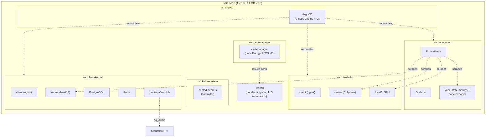
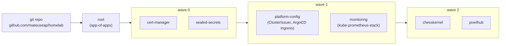
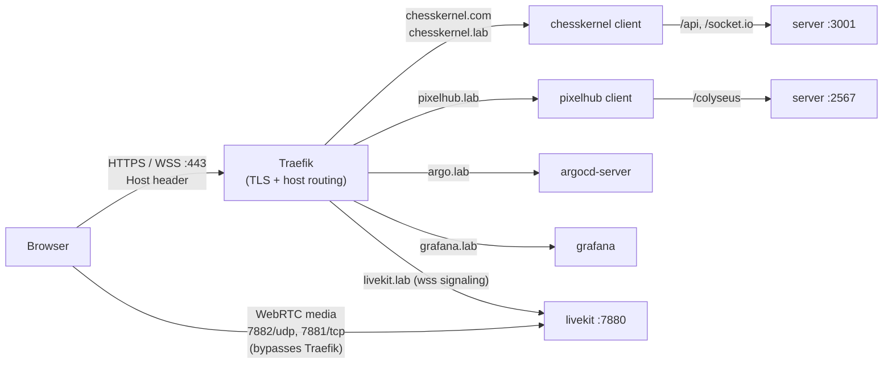
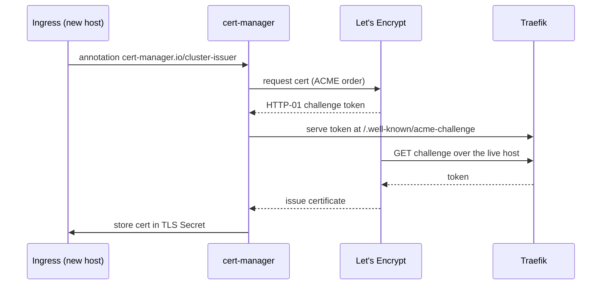
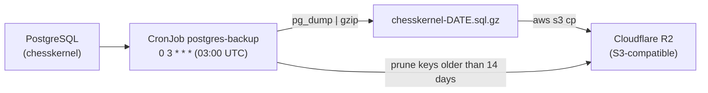

# Platform Overview

This homelab is one VPS (1 vCPU, 4 GB, 179.197.71.43) running single-node k3s, declared entirely in this git repo. ArgoCD watches the repo and makes the cluster match it. Two applications run on top: ChessKernel and PixelHub.

For the decisions behind this design, see the [ADRs](../adr/). For the original design note, see [docs/specs](../specs/). For step-by-step operations, see the [runbook](../RUNBOOK.md).

## Cluster components

The control plane and the kubelet run inside a single k3s process. Traefik, CoreDNS, and local-path storage ship with k3s. Namespaces carry a human-readable `homelab.mateuseap.com/description` annotation and are protected from pruning (see [Namespaces](#namespaces)).

## GitOps flow and sync waves

`bootstrap/install.sh` installs k3s and ArgoCD, then applies a single object: the `root` app-of-apps. `root` watches `argocd/`, and every Application there is reconciled continuously with automated prune and self-heal. Ordering is expressed with sync waves.

- **Wave 0**: cert-manager (CRDs) and sealed-secrets (secret decryption). Everything else depends on these.
- **Wave 1**: platform-config (the `letsencrypt-prod` ClusterIssuer and the ArgoCD UI ingress) and monitoring. Both need wave-0 CRDs.
- **Wave 2**: the applications, once the platform is healthy.

Adding a project is one folder in `apps/` and one Application in `argocd/`, then a push. See [operations/adding-an-app](../operations/adding-an-app.md).

## Traffic path

All hostnames resolve to the node through the `*.lab.mateuseap.com` wildcard record (plus ChessKernel's own domain). Traefik terminates TLS once and routes by `Host` header to the right backend Service. WebSocket (`wss`) rides the same path. The one exception is LiveKit's WebRTC media, which cannot go through Traefik because it is UDP.

Each client is an nginx container that serves the static bundle and proxies its API path to the in-cluster server Service (`/api` and `/socket.io` to `server:3001` for ChessKernel; `/colyseus` to `server:2567` for PixelHub). See the [networking doc](../networking.md) for the full host table and the LiveKit hostPort exception.

## TLS issuance

The single `letsencrypt-prod` ClusterIssuer solves HTTP-01 through Traefik, so no DNS provider token is needed. Certificates are per host and issue on first request once the host resolves. See [ADR-004](../adr/004-cert-manager-http01-vs-dns01.md).

## Backup flow

Credentials come from the sealed `r2-backup-credentials`. Restore is a manual `gunzip | kubectl exec ... psql` documented in the runbook, with a mandated quarterly restore drill. See [ADR-006](../adr/006-nightly-backups-to-cloudflare-r2.md).

## Namespaces

| Namespace | What runs there |
|-----------|-----------------|
| `argocd` | GitOps control plane and UI (`argo.lab.mateuseap.com`) |
| `cert-manager` | TLS automation (Let's Encrypt HTTP-01) |
| `kube-system` | k3s system components and the sealed-secrets controller |
| `monitoring` | Prometheus, Grafana, exporters (`grafana.lab.mateuseap.com`) |
| `chesskernel` | Client, NestJS server, PostgreSQL, Redis, backup CronJob |
| `pixelhub` | Client, Colyseus server, LiveKit SFU |

Each application and platform namespace carries a `homelab.mateuseap.com/description` annotation and `argocd.argoproj.io/sync-options: Prune=false`, so removing a namespace declaration never deletes a running namespace and its data (`platform/config/namespaces.yaml`).

## Monitoring model

kube-prometheus-stack (chart 62.7.0) is trimmed for the node: 5-day / 2 GB retention, Alertmanager disabled (Grafana shows state), and the chart's default dashboards disabled in favor of a single curated one. Both application servers expose `/metrics` on their cluster-internal service port (never through the public ingress), scraped by `ServiceMonitor`s at a 60s interval. LiveKit exposes its native Prometheus endpoint on port 6789, also cluster-internal, scraped by its own `ServiceMonitor`.

The one curated dashboard, **Homelab Overview**, has four sections:

| Section | Panels |
|---------|--------|
| VPS | CPU busy, memory used, root disk used, load, uptime, pods running, CPU usage by type, memory breakdown, network traffic |
| Kubernetes | CPU by namespace, memory by namespace, pod restarts (24h), top pods by memory |
| ChessKernel | games active, players connected, usage over time, Stockfish load |
| PixelHub | players online, in voice now, activity per hour, players over time, voice participants over time |

See [operations/adding-an-app](../operations/adding-an-app.md) for the ServiceMonitor pattern and the monitoring/upgrade notes.
