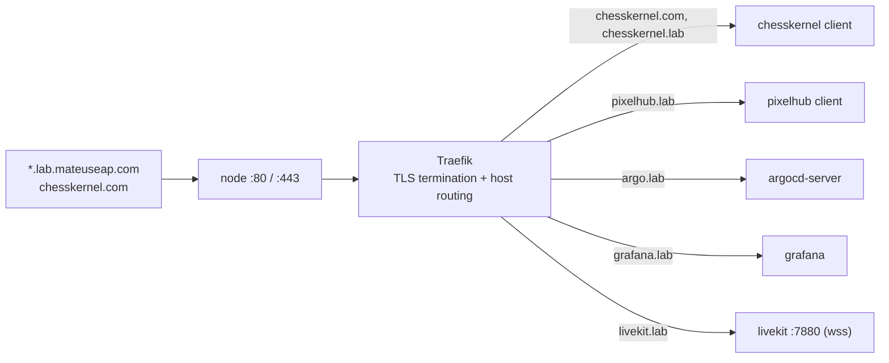

# Networking

One node, one IP, many hostnames. This document describes how names reach the node, how the node routes them, how certificates are issued, and the single exception to host-based routing (LiveKit media). For the decisions behind it, see [ADR-005](adr/005-wildcard-dns-traefik-sni-routing.md) and [ADR-004](adr/004-cert-manager-http01-vs-dns01.md).

## Wildcard DNS

A single wildcard A record, `*.lab.mateuseap.com`, points at the node IP. Any subdomain under `lab.mateuseap.com` resolves to the node with no further DNS change, so adding a service never touches DNS. ChessKernel's apex and `www` point at the same node with their own records.

### Creating the DNS records

The platform needs exactly one record to serve any number of `.lab` hosts, plus one apex record (and usually `www`) per custom domain.

| Record | Type | Value | Where to create it |
|--------|------|-------|--------------------|
| `*.lab` | A | node public IP | the `mateuseap.com` DNS provider |
| a custom apex, e.g. `chesskernel.com` | A | node public IP | that domain's DNS provider |
| `www` on the custom domain | A (or CNAME to the apex) | node public IP | same provider |

The apex of `mateuseap.com` and its `www` stay on GitHub Pages; only the `*.lab` label is delegated to the node, so the wildcard never collides with the public site. Adding a `.lab` service needs no new record because the wildcard already covers it. A custom domain needs its own apex record because a wildcard for one registrable domain does not cover a different one. Keep the TTL low (300s) while setting up, and confirm resolution with `dig +short <host>` before expecting a certificate: cert-manager can only pass HTTP-01 once the host resolves to the node.

## Traefik ingress and SNI host routing

Traefik ships with k3s and is the single ingress controller. Every service declares an `Ingress` with `ingressClassName: traefik` and a `host:` rule. Ports 80 and 443 are shared by all hosts; Traefik terminates TLS, reads the SNI / `Host` header, and routes to the matching backend Service. HTTP, HTTPS, and WebSocket (`wss`) all route this way.



## Hostname map

| Host | Backend | Notes |
|------|---------|-------|
| `chesskernel.com` | ChessKernel client | Production domain; own Ingress + cert (`chesskernel-own-tls`) |
| `www.chesskernel.com` | ChessKernel client | Shares the production Ingress |
| `chesskernel.lab.mateuseap.com` | ChessKernel client | Separate Ingress + cert (`chesskernel-lab-tls`) |
| `pixelhub.lab.mateuseap.com` | PixelHub client | `pixelhub-tls` |
| `argo.lab.mateuseap.com` | ArgoCD server | TLS at Traefik; ArgoCD runs insecure internally |
| `grafana.lab.mateuseap.com` | Grafana | Ingress defined in the monitoring chart values |
| `livekit.lab.mateuseap.com` | LiveKit signaling | `wss` signaling only; media bypasses Traefik (see below) |
| `homelab.mateuseap.com` | Landing page (apps/landing) | Own A record, not under the `*.lab` wildcard; static showcase served by the cluster |

### Why ChessKernel has two Ingress objects

Traefik drops an Ingress's entire TLS configuration if any referenced certificate Secret is missing. Before the `*.lab.mateuseap.com` wildcard existed, the lab host could not pass HTTP-01, so its certificate could not issue. Splitting the production domain and the lab host into two separate Ingress objects means a pending lab certificate never takes down TLS for `chesskernel.com`. This is the general pattern to follow whenever one host resolves and another does not yet.

## Adding a custom domain to an app

To serve an app on its own domain, the way ChessKernel runs on `chesskernel.com`:

1. **DNS.** Create an apex `A` record for the domain pointing at the node IP, and usually a `www` record too (see the records table above). Confirm both resolve with `dig +short yourdomain.com` and `dig +short www.yourdomain.com`.
2. **Ingress.** Add the hostnames to the app. If the app also serves a host that might not resolve yet, put the custom domain in its own `Ingress` so a pending certificate on the other host cannot drop its TLS (the two-Ingress pattern above). Otherwise add the host rules and a matching `tls:` entry to the existing Ingress:

   ```yaml
   spec:
     rules:
       - host: yourdomain.com
         http: &routes
           paths:
             - path: /
               pathType: Prefix
               backend:
                 service:
                   name: client
                   port: { number: 80 }
       - host: www.yourdomain.com
         http: *routes
     tls:
       - hosts: [yourdomain.com, www.yourdomain.com]
         secretName: <app>-own-tls
   ```

3. **App config.** Update any origin or CORS setting to the new domain. ChessKernel sets `CLIENT_ORIGIN: https://chesskernel.com` in `apps/chesskernel/server.yaml`.
4. **Push.** ArgoCD applies it and cert-manager issues the certificate over HTTP-01 as soon as the domain resolves. Watch it: `kubectl -n <app> get certificate`. The host is live once the certificate is `Ready`.

No node access is needed. It is all git plus the DNS records.

## cert-manager

A single `ClusterIssuer`, `letsencrypt-prod`, solves ACME HTTP-01 through Traefik (`platform/config/cluster-issuer.yaml`). Each Ingress requests a certificate with the `cert-manager.io/cluster-issuer: letsencrypt-prod` annotation and a `tls:` block naming the Secret to store it in. Certificates are per host and issue on first request once the host resolves; the wildcard record covers resolution, not certificates. No DNS provider token is used. See [ADR-004](adr/004-cert-manager-http01-vs-dns01.md).

## The LiveKit media exception

Traefik proxies HTTP, HTTPS, and WebSocket by host, but it cannot proxy arbitrary UDP. LiveKit's WebRTC media therefore does not go through the ingress. Only the signaling channel (`wss` on `livekit.lab.mateuseap.com`, port 7880) uses Traefik; media uses node `hostPort`s directly (`apps/pixelhub/livekit.yaml`):

| Port | Protocol | Purpose | Path |
|------|----------|---------|------|
| 7880 | TCP (wss) | Signaling | Through Traefik ingress (`livekit.lab.mateuseap.com`) |
| 7882 | UDP | WebRTC media (single mux port) | `hostPort` directly on the node |
| 7881 | TCP | WebRTC media TCP fallback | `hostPort` directly on the node |
| 6789 | TCP | Prometheus metrics | Cluster-internal only, scraped by ServiceMonitor |

Because the LiveKit pod binds host ports, only one replica can run, so its Deployment uses `strategy: Recreate` and `enableServiceLinks: false` (the injected `LIVEKIT_PORT` service-link env would otherwise crash the server). `use_external_ip: true` makes LiveKit advertise the node's public IP for media.

A new or migrated node must allow `7882/udp` and `7881/tcp` in any provider-level firewall, alongside 80 and 443. See the [security doc](security/security.md) for the recommended firewall posture.
